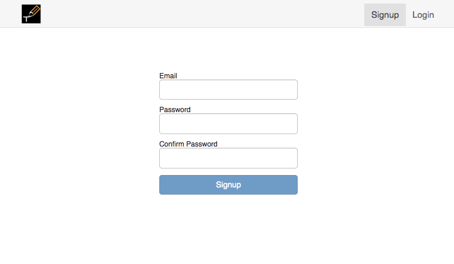
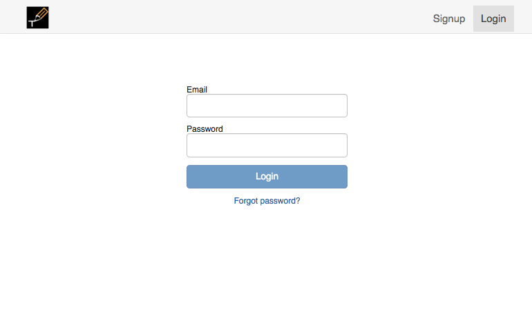
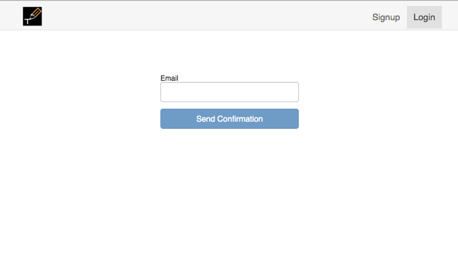
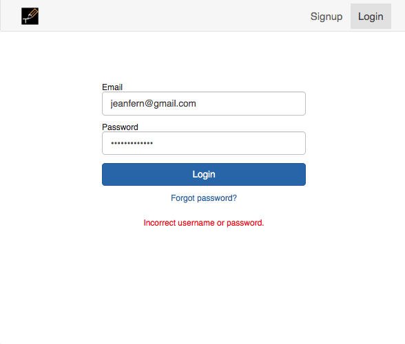
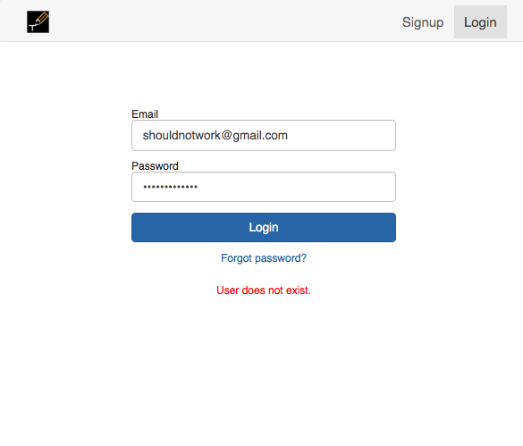
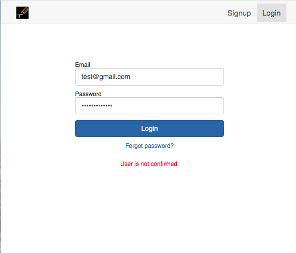
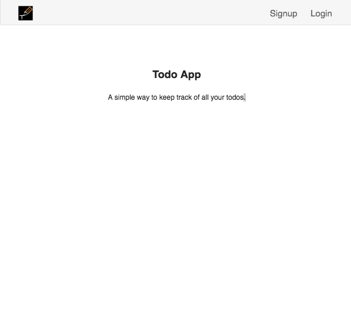

# Todo-List

Overview: Full-stack solution for a todo list application.

## Table of Contents
* [Frontend](#frontend)
* [Backend](#backend)
* [Stretch](#stretch)
* [Local Setup](#local-setup)

## Frontend:
* Authentication
    * The authentication functionality supports Signup, Login, and Forgot Password
      
    * The application is not be accessible (other than the authentication screens) without users being logged in and if their account is not confirmed

         

    
* Screens
    * Home
       * All Todos
           * The home screen shall display a list of the current users todos
       * Todo Detail
           * If a todo is clicked, the user will be brought to the Todo Detail screen
           * The selected todo will be displayed and convey its information: title, date, and notes
       * Add a Todo
           * If the user clicks on “+” they will be brought to the Add a Todo screen
           * This screen will display a form with the todo information that the user will submit
           * Upon a successful submit, the user shall be brought to the Home screen
       * Edit a Todo
           * If the user clicks on “☰” they will be brought to the Edit a Todo screen
           * This screen will be similar to the Add a Todo screen, but will have the current todo information pre­filled in the form
           * As with the Add a Todo screen, a successful submission will bring the user to the Home screen
       * Deleting Todos
           * If the user clicks on trash icon they will be brought to the Delete a Todo screen

        
## Backend:
* Authentication
    * As long as the requirements are met (login, register, and forgot password), implementation is up to the student. A few ideas include:
        * Session-based auth (NodeJS server)
        * Token-based auth (NodeJS server)
        * `AWS Cognito`
    * While there is no wrong choice, be prepared to explain the pros and cons of the choice you make. It is okay to choose an ‘easier’ solution as long as you can explain the downfalls and what a better solution would look like
* Todos
    * The service layer for todos may be written in any of the following
        * NodeJS (feel free to use any routing / other packages)
        * `Graphql`
    * Your API endpoint for todos should have the following functionalities
        * Add a todo
        * Edit a todo
        * Delete a todo
        * List todos
    * All routes should be secured based on the user authentication method you choose
* Database
    * Any database type and implementation is fair game to use, it is up to the student to decide. Some ideas include:
        * MySQL
        * MongoDB
        
## Stretch: 
Any of the items `highlighted` above are slightly advanced topics and will demonstrate a students drive and willingness to learn. Implementing any of the below will also show the same (all extra credit is weighted equally):
* Instead of writing a web-based application, write the frontend in `React Native`
    * FYI: if students do not have a mac, they can use Expo
    * If Expo does not support any native packages desired, write a detailed explanation of how you would implement that package
* Write automated tests for the backend todo functionality using `Chai` and `Mocha`
* If writing the frontend in React.js, automate frontend e2e tests using `Cypress.io`
* If writing the frontend in React Native, automate the frontend e2e tests using `Detox`

## Local Setup:
