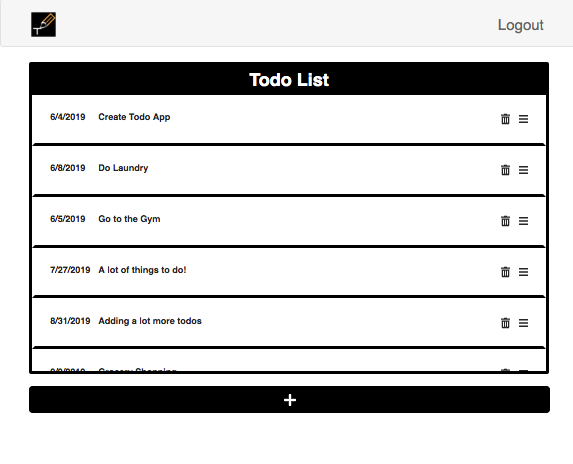
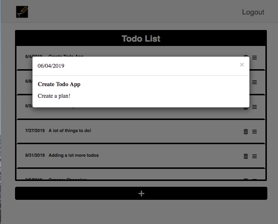
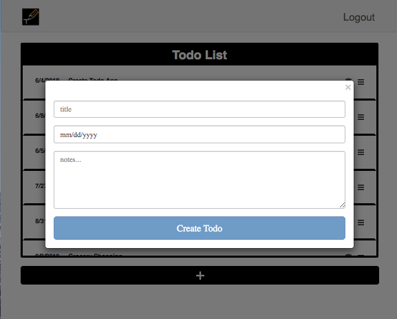
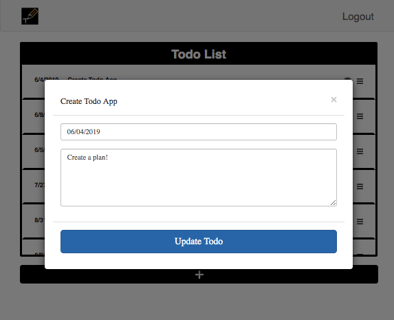
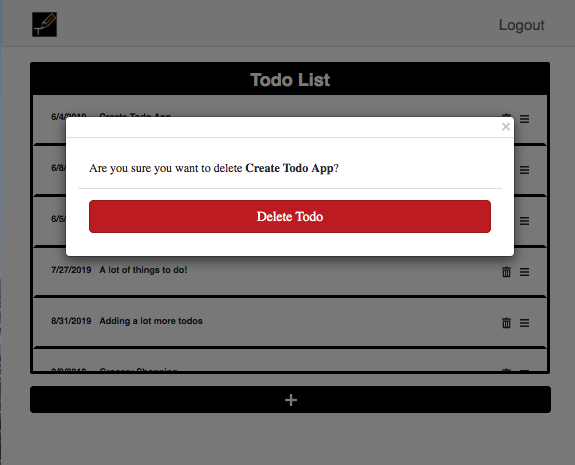

# Todo-List

Overview: Full-stack todo list application.

## Table of Contents
* [Local Setup](#local-setup)
* [Frontend](#frontend)
* [Backend](#backend)

## Local Setup:

## Frontend:
* Authentication
    * The authentication functionality supports Signup, Login, and Forgot Password
    
      
    * The application is not be accessible (other than the authentication screens) without users being logged in and if their account is not confirmed

         

    
* Screens
    * Home
       * All Todos
           * The home screen shall display a list of the current users todos
           
       * Todo Detail
           * If a todo is clicked, the user will be brought to the Todo Detail screen
           * The selected todo will be displayed and convey its information: title, date, and notes
           
       * Add a Todo
           * If the user clicks on “+” they will be brought to the Add a Todo screen
           * This screen will display a form with the todo information that the user will submit
           * Upon a successful submit, the user shall be brought to the Home screen
           
       * Edit a Todo
           * If the user clicks on “☰” they will be brought to the Edit a Todo screen
           * This screen will be similar to the Add a Todo screen, but will have the current todo information pre­filled in the form
           * As with the Add a Todo screen, a successful submission will bring the user to the Home screen
           
       * Deleting Todos
           * If the user clicks on "" they will be brought to the Delete a Todo screen
           

## Backend:
* Authentication
    * Signup, Login, and Forgot Password was set using AWS Cognito.
* Todos
    * The service layer for todos Node and GraphQL.
    * API endpoint for todos have the following functionalities
        * Add a todo
        * Edit a todo
        * Delete a todo
        * List todos
    * All routes are secured with AWS Cognito
* Database
    * Database used was MongoDB
        
